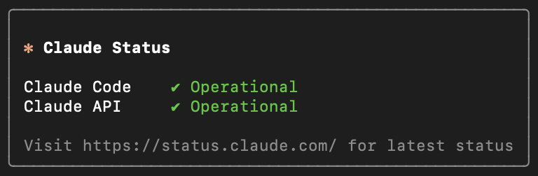

# downlaude

> CLI to check Claude's service status from your terminal



## Install

```bash
npm install --global downlaude
```

## Usage

```bash
downlaude          # show Claude API + Claude Code status
downlaude --all    # show all Claude services
downlaude --silent # no output; use exit code in scripts
```

## Options

| Flag | Alias | Description |
|------|-------|-------------|
| `--all` | `-a` | Show all Claude services (claude.ai, Claude Console, Claude API, Claude Code, Claude Cowork, Claude for Government) |
| `--silent` | `-s` | No output. Exit `0` if operational, `1` if outage, `2` if unreachable |
| `--help` | `-h` | Show help |

## Exit codes (--silent)

| Code | Meaning |
|------|---------|
| `0` | All operational |
| `1` | At least one outage |
| `2` | Could not reach status page |

## Scripting

```bash
downlaude --silent || echo "Claude is having issues"
downlaude --silent --all && deploy.sh
```
